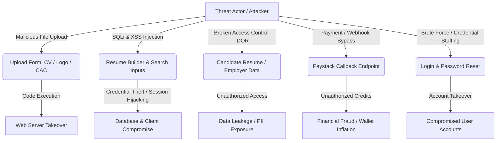
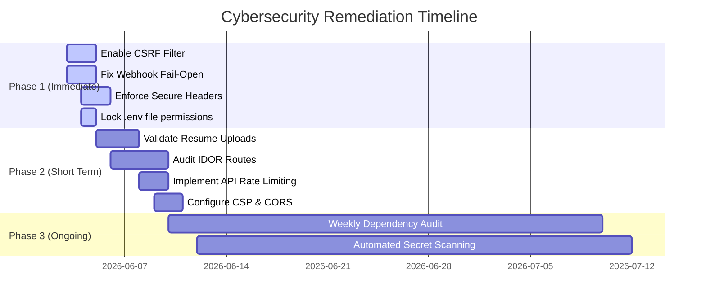

# JobberRecruit Enterprise Cybersecurity & Data Protection Plan

## 1. Executive Summary
This document defines the comprehensive cybersecurity, data protection, and incident response strategy for the **JobberRecruit** platform. JobberRecruit operates as a multi-tenant recruitment application processing highly sensitive Personally Identifiable Information (PII) of candidates (resumes, contact details, profile data), employer verification documentation (Corporate Affairs Commission - CAC registration certificates), and financial operations (Paystack card transactions, wallet funding, and escrow payments). 

As the platform handles both candidate and corporate data, maintaining high confidentiality, system integrity, and service availability is paramount. This plan establishes concrete technical controls, administrative policies, and remediation maps based on the specific architecture of our CodeIgniter 4 framework, Shield authentication library, and external service integrations.

---

## 2. Asset & Data Classification
To apply cost-effective security boundaries, we classify all system resources and data into three security tiers:

| Tier | Classification | Description / Items | Storage Location | Protection Mechanisms |
| :--- | :--- | :--- | :--- | :--- |
| **Tier 1** | **Highly Restricted (Confidential)** | Passwords, API Keys (Paystack, OpenAI, SMTP, Cloudinary), Database credentials, Encryption keys, Wallet balances, transaction records. | Database (hashed/encrypted), `.env` configuration files, Escrow microservice. | Bcrypt/Argon2 hashing, HMAC signature checks, strict server-side encryption, restricted IAM, file permissions (400). |
| **Tier 2** | **Private (PII / Sensitive)** | Candidate Resumes (CVs), phone numbers, email addresses, employer CAC registration documents, direct chats. | Database, candidate/employer uploads directory (`writable/uploads/` or `public/uploads/`). | Access Control Lists (ACLs), strict MIME validation, directory traversal prevention, data masking. |
| **Tier 3** | **Public** | Active job posts, public employer profiles, blogs, webinar announcements, FAQs. | Database, public web directories. | Global Content Delivery Network (CDN) caching, read-only public routes. |

---

## 3. Core Threat Model & Risk Assessment
The primary attack vectors and security risks identified for the JobberRecruit architecture are defined below:



### 3.1. Specific Vulnerability Scenarios
*   **Malicious Code Execution via Uploads (High Risk):** Attackers uploading PHP web shells (e.g. `shell.php`) masked with double extensions or spoofed MIME types.
*   **Broken Access Control & IDOR (High Risk):** Unauthorized users bypassing controller logic to download candidate resumes or edit employer profiles by manipulating sequential integer IDs (e.g., changing `/employer/download-cv/5` to `/employer/download-cv/6`).
*   **CSRF & Session Takeover (Medium Risk):** Bypassing state-changing forms (like updating wallet balances or changing passwords) via Cross-Site Request Forgery.
*   **Payment & Webhook Bypasses (High Risk):** Attackers forging HTTP POST requests to `/webhooks/paystack` to artificially credit wallets.
*   **Data Scraping (Medium Risk):** Bot networks scraping candidate directories.
*   **Credential Stuffing & Brute Force (Medium Risk):** Automated attacks against the `/login` and `/forgot-password` routes attempting to guess credentials.

---

## 4. Platform Security Audit & Findings
An audit of the JobberRecruit application configurations and controllers revealed several critical security gaps that must be patched immediately.

> [!WARNING]
> **Critical Code-Level Security Findings**
> 1. **Disabled CSRF Protection:** Cross-Site Request Forgery (`csrf`) is commented out in `Config\Filters.php` globally. State-changing POST/PUT requests are currently vulnerable to unauthorized execution.
> 2. **Disabled Secure Headers:** The `secureheaders` filter is disabled in `Config\Filters.php`. Browser-side protections (like clickjacking, MIME sniffing, and HSTS) are inactive.
> 3. **Unvalidated Candidate Uploads:** `JobSeekerController::update_profile()` handles profile picture and resume uploads without validating extensions, MIME types, or sizes at the framework boundary.
> 4. **Fail-Open Webhook Signature Verification:** `WebhookController::paystack()` fails open if `PAYSTACK_SECRET_KEY` is not loaded in `.env`.
> 5. **Missing Rate Limiting:** Login endpoints and webhook endpoints lack rate-limiting, leaving them susceptible to brute-force and Denial of Service (DoS) attacks.

---

## 5. Technical Security Controls

### 5.1. Authentication, Sessions & RBAC
JobberRecruit leverages **CodeIgniter Shield** for session and authentication management.
*   **Strong Password Policy:** Implement the `strong_password` validation rule in Shield for all user types. Passwords must be a minimum of 8 characters, containing uppercase, lowercase, numbers, and symbols.
*   **Session Hardening:** 
    *   Set `sessionCookieName` to a custom value to avoid default PHP identifier tracking.
    *   Enforce `sessionRegenerateDestroy = true` to prevent session fixation attacks.
    *   Set the session driver cookie settings: `cookieSecure = true` (in production), `cookieHTTPOnly = true`, and `cookieSameSite = 'Lax'`.
*   **Role-Based Access Control (RBAC):** Group routes using defined CodeIgniter route filters to prevent privilege escalation.

### 5.2. Input Validation & XSS Prevention
*   **Strict Whitelist Validation:** Validate all inputs using CodeIgniter's strict rules. Never process raw request arrays without parsing them through the validator.
*   **Output Escaping:** When rendering data dynamically in views, always escape variables to prevent Cross-Site Scripting (XSS) via `esc($var, 'html')` or `esc($var, 'attr')`.

### 5.3. Hardening File Upload Security
To mitigate file upload risks (web shell execution and local file inclusion):
1.  **Framework-Level Validation:** Enforce strict type, extension, and size boundaries using `uploaded`, `max_size`, `ext_in`, and `mime_in` validation rules.
2.  **Safe File Renaming:** Never preserve the original file name submitted by the user. Use random name generators (`$file->getRandomName()`).
3.  **Storage Out of Web Root:** Store sensitive verification files (such as employer CAC documents) in `WRITEPATH . 'uploads/'` (outside public web root), serving them via a proxy controller rather than direct URLs.
4.  **Apache Execution Prevention:** Deploy a `.htaccess` file inside `public/uploads/` directory to strictly disable script execution (`RemoveHandler` and `ForceType text/plain` for `.php`, `.phtml`, etc.).

### 5.4. CSRF Enforcement
CSRF protection must be activated globally. We configure CodeIgniter's Security library to use session-based, randomized tokens:
```php
// app/Config/Security.php
public string $csrfProtection = 'session';
public bool $tokenRandomize   = true;
public bool $regenerate       = true; // Regenerate token on POST actions
```
Enable CSRF globally in `Filters.php`, while explicitly excluding external APIs and webhooks that utilize payload signatures.

### 5.5. Paystack Webhook Hardening
Paystack webhooks must be protected against spoofing. Modify `WebhookController` to **fail-closed** when keys are missing or when signatures do not match.

### 5.6. Rate Limiting & Anti-Brute Force (New)
CodeIgniter 4's `Throttler` must be implemented to prevent brute force, credential stuffing, and application-layer DoS.
*   **Auth Routes:** Limit `/login` and `/forgot-password` to **5 attempts per minute per IP**.
*   **Webhooks:** Limit Paystack webhooks to **60 requests per minute per IP** to prevent webhook flooding.
*   **Global API Routes:** Apply a general rate limit of **100 requests per minute** for authenticated users across API endpoints.

### 5.7. Cross-Origin Resource Sharing (CORS) (New)
If JobberRecruit exposes APIs to external clients or subdomains (like a React Native app or decoupled frontend), implement a strict CORS filter.
*   **Allowed Origins:** Explicitly define trusted origins (e.g., `https://jobberrecruit.com`, `https://admin.jobberrecruit.com`). Never use `*` in production.
*   **Allowed Methods:** Restrict to `GET, POST, PUT, DELETE, OPTIONS`.

---

## 6. Infrastructure & Network Security

### 6.1. HTTPS Enforce & SSL/TLS Configuration
*   **Redirect Rules:** Configure rewrite conditions in `.htaccess` to redirect HTTP requests to HTTPS permanently (301 redirect).
*   **HSTS (Strict Transport Security):** Enforce secure connections in supported browsers. The `secureheaders` filter will inject `Strict-Transport-Security`.

### 6.2. Security Headers
The following headers must be returned by the server on every response (handled in `Config\SecureHeaders.php`):
*   `X-Frame-Options: SAMEORIGIN` (prevents clickjacking)
*   `X-Content-Type-Options: nosniff` (prevents MIME sniffing)
*   `Referrer-Policy: strict-origin-when-cross-origin`
*   `Content-Security-Policy` (CSP): Define source allowances. E.g., `default-src 'self'; script-src 'self' 'unsafe-inline' https://js.paystack.co; object-src https://checkout.paystack.com;`.

### 6.3. Database Hardening
*   **Network Isolation:** MariaDB instances must only listen on local loopback (`127.0.0.1`) or inside a private VPC. 
*   **SQL Parameterization:** Never use string concatenation in SQL queries. Always utilize CodeIgniter Query Builder or bound query parameters to eliminate SQL Injection (SQLi) risks.

### 6.4. File System Permissions & Secrets Management (New)
*   **Directory Permissions:** Webroot directories (`public/`) and application folders (`app/`, `system/`) must be restricted to `755` for directories and `644` for files.
*   **Writable Directory:** The `writable/` directory requires `775` (or `777` depending on server setup, but restricted to the `www-data` group) to allow logging and caching, but must explicitly deny execution of scripts.
*   **Environment Variables (`.env`):**
    *   Set `.env` file permissions to `400` or `440` so only the web server user can read it.
    *   Ensure `.env` is listed in `.gitignore` and never committed to version control.
    *   Rotate API keys and database credentials every 90 days or immediately upon suspected compromise.

---

## 7. Compliance & Regulatory Standards (GDPR & NDPR)
As a platform processing personal data of users in Nigeria and globally, JobberRecruit complies with the **Nigeria Data Protection Regulation (NDPR)** and the **General Data Protection Regulation (GDPR)**.

1.  **Right to Information & Consent:** Users must opt-in explicitly before their resume or company CAC document is processed. Consent checkboxes are stored with timestamps in the DB.
2.  **Right to Erasure (Right to be Forgotten):** When a candidate deletes their profile, all stored resume files, profile pictures, and database rows are purged completely from storage.
3.  **Data Portability:** Candidates and employers can download all their stored information (via GDPR export routes) in a structured JSON payload.
4.  **Data Processing Agreements (DPA):** Ensure that third-party processing integrations (Paystack, Cloudinary, OpenAI) are covered by standard contractual clauses for secure transmission of data.

---

## 8. Incident Response Plan (IRP) & Monitoring
In the event of a security incident or data breach, JobberRecruit will follow the structured process outlined below:

```
[Detection] ──> [Containment] ──> [Eradication] ──> [Recovery] ──> [Post-Incident Review]
```

### Phase 1: Detection, Alerting & Analysis
*   **Triggers:** Implement structured logging to detect SQL error anomalies, rapid `403 Forbidden` bursts (indicating directory brute-forcing), and failed login spikes. Send Critical logs to a dedicated Slack/Email channel.
*   **Verification:** Validate if the incident constitutes a true breach or a false positive.

### Phase 2: Containment
*   **Application Containment:** If the breach is actively ongoing, trigger **Maintenance Mode** (via CodeIgniter configuration) to block external access.
*   **Credential Containment:** Revoke/rotate credentials on external provider dashboards. Update `.env.production` immediately. Invalidate active user session tables in the database.

### Phase 3: Eradication
*   **Malicious File Removal:** Delete any injected shells, scripts, or backdoors.
*   **Vulnerability Remediation:** Merge hotfixes to address the underlying vulnerability.

### Phase 4: Recovery
*   **Integrity Verification:** Inspect database tables for unauthorized changes.
*   **Data Restoration:** If database tables are corrupted, restore the latest secure backup snapshot.

### Phase 5: Post-Incident & Notification
*   **Regulatory Reporting:** Notify the Nigeria Data Protection Bureau (NDPB) and relevant European data protection authorities (if GDPR scope applies) within **72 hours** of breach discovery if personal data was compromised.
*   **User Communication:** Email affected candidates and employers with details of the breach and steps they can take to secure their credentials.

---

## 9. Actionable Cybersecurity Roadmap
Remediation of platform security vulnerabilities is prioritized into three immediate phases:



### Phase 1: High Priority (Immediate Actions - 48 Hours)
1.  **Enable CSRF globally** in `Filters.php` and exclude public payment webhook urls.
2.  **Enable `secureheaders` filter** in `Filters.php` to inject browser protection headers.
3.  **Hardcode Paystack Webhook fail-closed logic** in `WebhookController.php`.
4.  **Create `.htaccess` rules** in candidate and employer uploads folders to disable script execution.
5.  **Secure `.env` and Permissions:** Apply `400` permissions to the `.env` file and ensure it is not tracked in git.

### Phase 2: Medium Priority (Within 1 Week)
1.  **Add upload validation rules** to candidate profile pictures and resume uploads in controllers.
2.  **Audit candidate IDOR access points:** Check controllers that return resume file downloads to ensure proper ownership checks.
3.  **Implement Rate Limiting:** Add Throttler logic to login routes and webhook endpoints.
4.  **Define Content Security Policy (CSP):** Restrict inline scripts and external domains to prevent XSS payloads from executing.

### Phase 3: Low & Maintenance Priority (Ongoing)
1.  **Schedule automated dependency scans** using `composer audit` and `npm audit` inside build pipelines.
2.  **Integrate Secret Scanning:** Add a tool like `gitleaks` or `trufflehog` to the CI/CD pipeline to prevent accidental key commits.
3.  **Rotate API keys and production credentials** every 90 days.
4.  **Run biannual penetration testing** on candidate search, escrow billing flows, and API endpoints.
